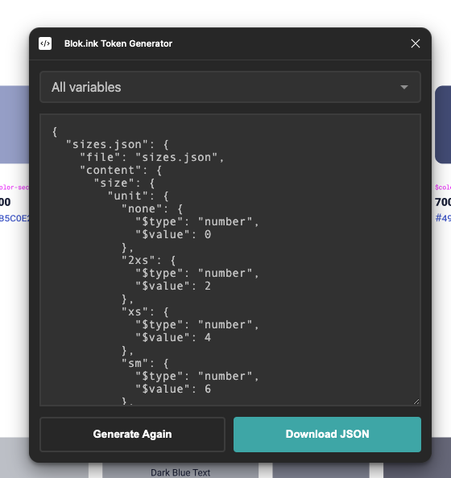
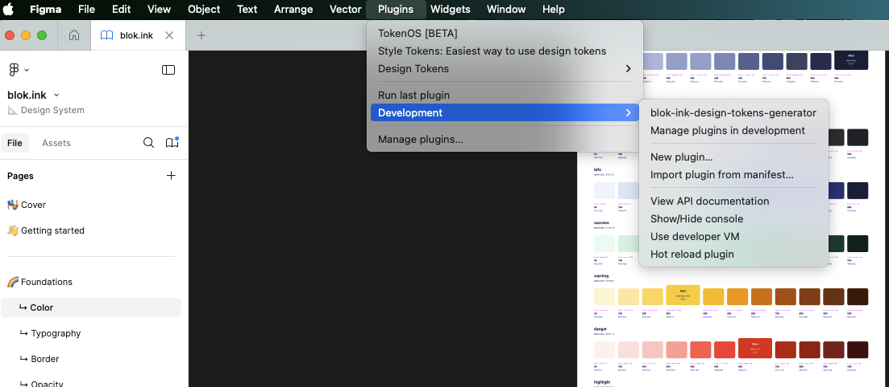
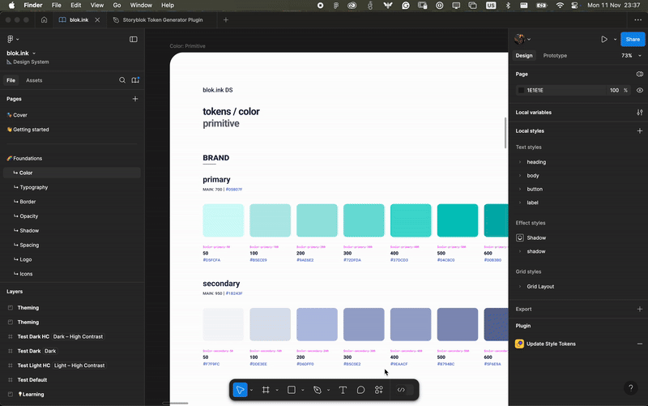

# Blok.ink Design tokens



## What is the purpose of the plugin?

When we tested the Community Figma plugins to export our DS variables, we figured out that we have some specificities, like the color structure and the different themes/modes. So, we decided to use Figma's plugin architecture to develop a small plugin that gets all the variables and creates a single JSON with the structure we need to create the tokens.

## How to execute the plugin locally?

Below are the steps to get your plugin running. You can also find instructions at:

 https://www.figma.com/plugin-docs/plugin-quickstart-guide/

This plugin template uses Typescript and NPM, two standard tools for creating JavaScript applications.

First, you will need to build the code.ts file:

```sh
# install the dependencies
yarn

# build just once
yarn build

# watch the changes
yarn watch
```

Then, import the plugin using the option *Plugins -> Development -> Import plugin from manifest*



To execute it, just select it from the option in the *Plugins -> Development* section.

## How to create the tokens?



When you have the plugin ready, you need to click on "Export Variables" to export these variables into a JSON, then click on "Download" to download them into a tokens.json file.

With this file, you need to copy it or save it in [storyfront/packages/design-tokens folder](https://github.com/storyblok/storyfront). There, you can create a js file to execute the following code snippet:

```js
const tokens = require('./tokens.json')
const fs = require('fs')

for (const key in tokens) {
  const token = tokens[key]
  const tokenContent = token.content
 fs.writeFileSync(`./tokens/${key}`, JSON.stringify(tokenContent, null, 2))
}
```

This code snippet just gets the tokens.json file and splits it into separate JSONs following the folder structure in [storyfront/packages/design-tokens folder](https://github.com/storyblok/storyfront/packages/design-tokens/tokens)